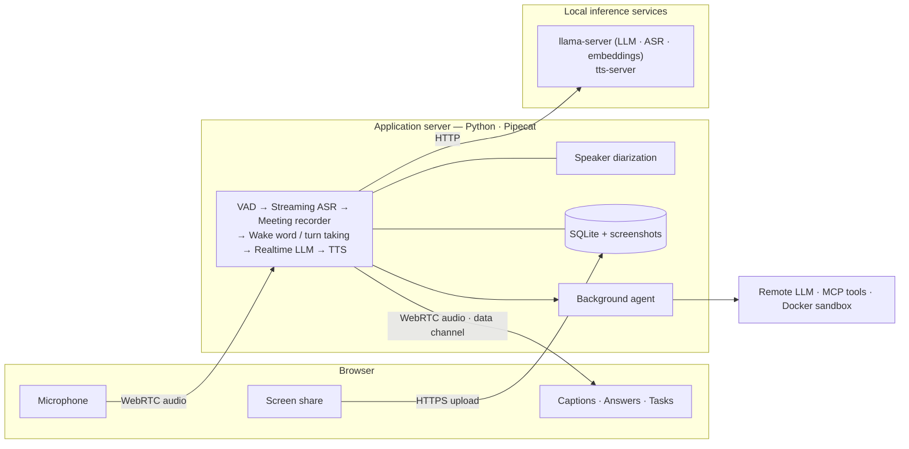

<div align="center">

# Agentic-Meeting

**A self-hosted voice assistant that sits in on your research group meetings.**

It transcribes the whole meeting with speaker labels, keeps the shared screen in sync,
answers within about a second when called by name, and hands longer jobs to a background agent.

[](https://github.com/weizyyy/Agentic-Meeting/actions/workflows/ci.yml)
[](LICENSE)
[](pyproject.toml)
[](https://github.com/pipecat-ai/pipecat)
[](https://github.com/astral-sh/ruff)

**English** · [简体中文](README.zh-CN.md)

<br/><br/>


<sub>The web page after a short meeting (demo data).</sub>

</div>

---

## Overview

Agentic-Meeting runs on a single GPU workstation in the meeting room and is used from a browser.
Speech recognition, speaker diarization and speech synthesis always run locally on open-weight
models. The conversational model can be served locally with llama.cpp or reached through any
OpenAI-compatible endpoint.

> [!NOTE]
> The web UI, the prompts and the CLI messages are currently in Chinese, and the default
> configuration targets Mandarin meetings with English technical terms mixed in.

## Features

- **Live transcript** — streaming captions with speaker labels and timestamps, stored in SQLite and
  searchable by keyword or meaning.
- **Screen timeline** — the shared screen is captured whenever it changes; every screenshot gets a
  short text summary and stays aligned with the transcript.
- **Wake-word assistant** — say the assistant's name and it answers in speech and text: summarize
  the discussion, recall who said what, or read a slide that was shown earlier.
- **Background agent** — web research, fact checking, calculations and plots run in the background
  (remote LLM + MCP tools + a Docker sandbox) and are reported back when they finish.
- **Typed questions** — ask in the text box when speaking up is inconvenient; the answer comes back
  as text only.
- **Resumable sessions** — refresh, switch devices or restart the server and continue the same
  meeting; other devices can follow along read-only.
- **After the meeting** — generate a structured report and export the transcript as Markdown, JSON,
  or a ZIP archive with screenshots and task artifacts.
- **Graceful degradation** — transcription keeps running when the LLM, TTS, embedding or
  diarization service is unavailable.

## How it works



| Component | Implementation |
|---|---|
| Voice pipeline | [Pipecat](https://github.com/pipecat-ai/pipecat) 1.12 with the SmallWebRTC transport |
| Realtime LLM | `llama-server` from [llama.cpp](https://github.com/ggml-org/llama.cpp), or any OpenAI-compatible chat completions endpoint |
| Streaming ASR, embeddings | `llama-server` |
| Speaker diarization | [NeMo-Speech.cpp](https://github.com/NVIDIA/NeMo-Speech.cpp), loaded in-process |
| Speech synthesis | [qwentts.cpp](https://github.com/ServeurpersoCom/qwentts.cpp) |
| Storage and retrieval | SQLite with FTS5 and [sqlite-vec](https://github.com/asg017/sqlite-vec) |
| Background agent | [OpenAI Agents SDK](https://github.com/openai/openai-agents-python), MCP servers, Docker sandbox |
| Web client | Vite, React, TypeScript |

See [docs/architecture.md](docs/architecture.md) for the design in detail.

## Requirements

- Windows 11 or Linux with an NVIDIA GPU, or macOS on Apple silicon (see [Project status](#project-status))
- [uv](https://docs.astral.sh/uv/), Python 3.12, Node.js 22.18 or later, Git
- Model weights for ASR, diarization, TTS and embeddings ([what to download](docs/runtimes.md#4-model-files));
  the repository never downloads weights for you
- Optional: Docker, for the background agent's code sandbox

The local models used in our tests occupy roughly 15 GB of VRAM in total; smaller quantizations
fit in about 6.5 GB. See [docs/benchmarks.md](docs/benchmarks.md).

## Quick start

```bash
git clone https://github.com/weizyyy/Agentic-Meeting.git
cd Agentic-Meeting
git submodule update --init --depth 1

# 1. Python dependencies and inference runtimes
uv sync --extra agent
python scripts/runtimes.py fetch llama_cpp
python scripts/runtimes.py fetch nemo_speech
python scripts/runtimes.py build qwentts --backend cuda

# 2. Web client
cd client && npm install && npm run build && cd ..

# 3. Configuration
cp config/config.example.toml config/config.toml   # model paths, assistant name, endpoints
cp .env.example .env                               # API keys
uv run agentic-meeting check                       # lists anything still missing

# 4. Run
uv run agentic-meeting serve --with-services
```

Open <http://localhost:7860>, click **开始新会议** (Start meeting) and allow microphone access.
Browsers on other machines need HTTPS — see the
[getting started guide](docs/getting-started.md#access-from-other-devices).

## Documentation

| Guide | Contents |
|---|---|
| [Getting started](docs/getting-started.md) | Installation, model files, first run, HTTPS |
| [User guide](docs/user-guide.md) | Working with the web page during and after a meeting |
| [Configuration](docs/configuration.md) | Every section of `config.toml` |
| [Troubleshooting](docs/troubleshooting.md) | Microphone level, wake word, degraded services |
| [Runtimes and models](docs/runtimes.md) | Fetching and building runtimes, model files, multi-GPU setups |
| [Benchmarks](docs/benchmarks.md) | Latency, memory and accuracy measured on real hardware |
| [Architecture](docs/architecture.md) | Processes, pipeline, data flow, context management |
| [Interface reference](docs/interfaces.md) | Configuration schema, database, HTTP API, data-channel messages, tools |
| [Development](docs/development.md) | Conventions, testing, project layout |

Chinese versions of all documents are under [docs/zh-CN](docs/zh-CN).

## Performance at a glance

Measured on a 50-minute recording of a real multi-speaker panel, replayed in real time through the
full stack (RTX 2080 Ti 22 GB, realtime LLM on a LAN endpoint):

| Metric | Result |
|---|---|
| Caption lag (finalized text behind audio) | median 0.70 s, p95 0.78 s |
| Wake word → first text | median 1.5 s |
| Wake word → first audio | median 2.5 s |
| Speakers separated | 8 (the diarization model's limit) |
| Application memory | about 510 MB, flat after the first five minutes |

Full results and methodology are in [docs/benchmarks.md](docs/benchmarks.md).

## Project status

Version 0.1.0 is the first public release.

- Verified end to end on Windows 11 with NVIDIA GPUs. On Linux the unit-test suite passes, but the
  full system has not been run there yet; macOS is untested.
- The longest continuous run tested so far is 54 minutes.
- Latency figures were measured with the realtime LLM behind an OpenAI-compatible endpoint; the
  llama.cpp deployment mode has unit-test coverage but no published benchmark yet.

See [CHANGELOG.md](CHANGELOG.md) for release notes.

## Contributing

Bug reports and pull requests are welcome. Please read [CONTRIBUTING.md](CONTRIBUTING.md) first and
follow the [Code of Conduct](CODE_OF_CONDUCT.md). To report a vulnerability, see
[SECURITY.md](SECURITY.md).

## License

Released under the [MIT License](LICENSE).

The inference runtimes under `third_party/` and the model weights you download are distributed
under their own licenses, some of which are more restrictive than MIT. Check them before use.

## Acknowledgements

Agentic-Meeting builds on [Pipecat](https://github.com/pipecat-ai/pipecat),
[llama.cpp](https://github.com/ggml-org/llama.cpp),
[NeMo-Speech.cpp](https://github.com/NVIDIA/NeMo-Speech.cpp),
[qwentts.cpp](https://github.com/ServeurpersoCom/qwentts.cpp),
[sqlite-vec](https://github.com/asg017/sqlite-vec) and the
[OpenAI Agents SDK](https://github.com/openai/openai-agents-python).
