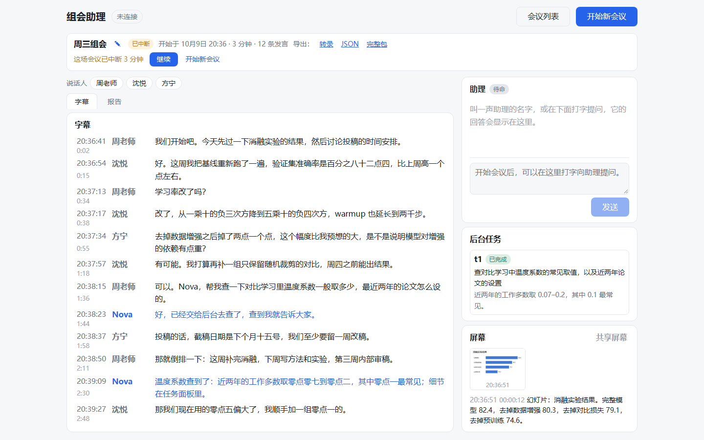
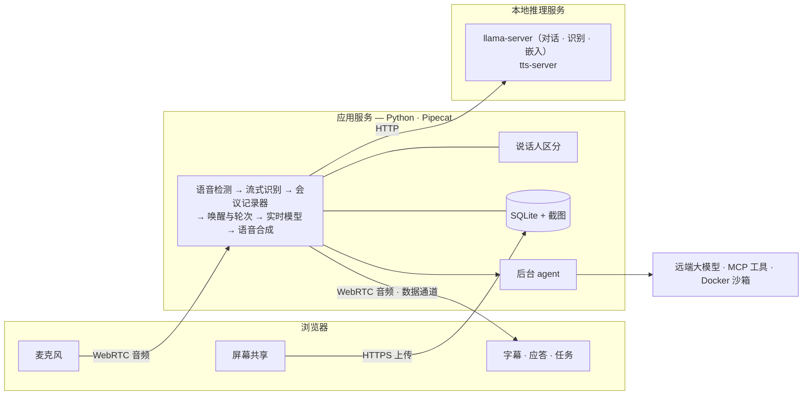

<div align="center">

# Agentic-Meeting

**完全本地运行的线下会议 AI 智能体助理。**

全程转录并区分说话人，同步保存共享屏幕，被叫到名字时约一秒内开口作答，耗时的工作交给后台 agent。

[](https://github.com/weizyyy/Agentic-Meeting/actions/workflows/ci.yml)
[](LICENSE)
[](pyproject.toml)
[](https://github.com/pipecat-ai/pipecat)
[](https://github.com/astral-sh/ruff)

[English](README.md) · **简体中文**

<br/><br/>



<sub>一场简短会议之后的页面（演示数据）。</sub>

</div>

---

## 简介

> [!NOTE]
> Agentic-Meeting 正处于密集开发阶段，配置项、接口和数据库结构在版本之间可能发生变化，
> 规划中的工作见[路线图](ROADMAP.zh-CN.md)。网页界面、提示词和命令行输出目前只有中文，
> 默认配置面向夹杂英文术语的中文会议。

Agentic-Meeting 是面向线下会议（而非视频会议）的 AI 助理，运行在会议室的一台 GPU 工作站上，
通过浏览器使用。据我们所知，它是最早一批同时做到以下三点的开源项目之一：

- **完全本地。** 语音识别、说话人区分和语音合成始终在本机完成，使用开放权重的模型；
  语言模型同样可以在本地部署。音频不会离开本机，也不需要任何云服务账号。
- **为线下会议而设计。** 会议室里一支麦克风、一块共享屏幕即可，不需要会议机器人，也不依赖会议平台。
- **智能体。** 不只是做记录：被叫到名字时开口作答，耗时的工作在后台完成。

因此它适合对隐私和合规要求较高、录音和转录不得离开本单位的会议。转录和截图只会发送到你所配置的模型接口，
这些接口可以在同一台机器上，也可以在自己的内网里；`agentic-meeting check` 会列出数据的去向。

> [!IMPORTANT]
> 目前还没有登录功能。请只在本机或受控的局域网内使用，不要暴露到公网。
> 访问口令是[路线图](ROADMAP.zh-CN.md)上的第一项。

## 功能

- **实时转录** —— 流式字幕，带说话人和时间，写入 SQLite，支持关键词和语义检索。
- **屏幕时间线** —— 共享屏幕在画面变化时自动截图，每张截图生成一段文字摘要，并与转录对齐。
- **唤醒应答** —— 叫助理的名字，它用语音和文字回答：整理讨论、回忆某人说过的话、查看之前展示过的幻灯片。
- **后台 agent** —— 联网检索、核实事实、计算和画图在后台进行（远端大模型 + MCP 工具 + Docker 沙箱），完成后口头简报。
- **文字提问** —— 不方便出声时在输入框里打字，助理只用文字回答。
- **会议可续** —— 刷新页面、更换设备或重启服务后可以继续同一场会议；其他设备可以只读旁观。
- **会后整理** —— 生成结构化的会议报告，导出 Markdown、JSON，或包含截图与任务产物的压缩包。
- **故障降级** —— 对话模型、语音合成、嵌入或说话人区分不可用时，转录照常进行。

## 工作原理



| 组成 | 实现 |
|---|---|
| 语音管线 | [Pipecat](https://github.com/pipecat-ai/pipecat) 1.12，SmallWebRTC 传输 |
| 实时模型 | [llama.cpp](https://github.com/ggml-org/llama.cpp) 的 `llama-server`，或任意 OpenAI 兼容的 chat completions 接口 |
| 流式识别、嵌入 | `llama-server` |
| 说话人区分 | [NeMo-Speech.cpp](https://github.com/NVIDIA/NeMo-Speech.cpp)，进程内加载 |
| 语音合成 | [qwentts.cpp](https://github.com/ServeurpersoCom/qwentts.cpp) |
| 存储与检索 | SQLite（FTS5 + [sqlite-vec](https://github.com/asg017/sqlite-vec)） |
| 后台 agent | [OpenAI Agents SDK](https://github.com/openai/openai-agents-python)、MCP 服务、Docker 沙箱 |
| 网页客户端 | Vite、React、TypeScript |

设计细节见 [docs/zh-CN/architecture.md](docs/zh-CN/architecture.md)。

## 环境要求

- 带 NVIDIA 显卡的 Windows 11 或 Linux，或 Apple 芯片的 macOS（见[项目状态](#项目状态)）
- [uv](https://docs.astral.sh/uv/)、Python 3.12–3.14、Node.js 22.18 及以上、Git
- 语音识别、说话人区分、语音合成和嵌入模型的权重（[需要哪些文件](docs/zh-CN/runtimes.md#4-模型文件)）；
  本仓库不会自动下载权重
- 可选：Docker，用于后台 agent 的代码沙箱

本地语音模型用一块 12 GB 显存的显卡即可运行：识别模型用 Q8 量化、语音合成用 0.6B 时，
全部本地服务合计占用略高于 10 GB。性能实测所用的配置（识别 f16、语音合成 1.7B）约占 15 GB。
对话模型若用 llama.cpp 部署在同一台机器上，需要另外的显存。
详见 [docs/zh-CN/runtimes.md](docs/zh-CN/runtimes.md#4-模型文件)。

## 快速开始

```bash
git clone https://github.com/weizyyy/Agentic-Meeting.git
cd Agentic-Meeting
git submodule update --init --depth 1

# 1. Python 依赖与推理运行时
uv sync --extra agent
python scripts/runtimes.py fetch llama_cpp
python scripts/runtimes.py fetch nemo_speech
python scripts/runtimes.py build qwentts --backend cuda

# 2. 网页客户端
cd client && npm install && npm run build && cd ..

# 3. 配置
cp config/config.example.toml config/config.toml   # 模型路径、助理名字、接口地址
cp .env.example .env                               # 密钥
uv run agentic-meeting check                       # 列出尚未填好的项

# 4. 运行
uv run agentic-meeting serve --with-services
```

浏览器打开 <http://localhost:7860>，点击「开始新会议」并允许使用麦克风。
其他电脑上的浏览器需要通过 HTTPS 访问，见
[入门指南](docs/zh-CN/getting-started.md#从其他设备访问)。

## 文档

| 文档 | 内容 |
|---|---|
| [入门指南](docs/zh-CN/getting-started.md) | 安装、模型文件、首次运行、HTTPS |
| [使用指南](docs/zh-CN/user-guide.md) | 会中与会后如何使用网页 |
| [配置说明](docs/zh-CN/configuration.md) | `config.toml` 的各个小节 |
| [故障排查](docs/zh-CN/troubleshooting.md) | 麦克风电平、唤醒、服务降级 |
| [运行时与模型](docs/zh-CN/runtimes.md) | 推理运行时的获取与构建、模型文件、多显卡分配 |
| [性能实测](docs/zh-CN/benchmarks.md) | 在真实硬件上测得的延迟、内存与准确率 |
| [架构](docs/zh-CN/architecture.md) | 进程、管线、数据流、上下文管理 |
| [接口参考](docs/zh-CN/interfaces.md) | 配置结构、数据库、HTTP 接口、数据通道消息、工具 |
| [开发指南](docs/zh-CN/development.md) | 约定、测试、目录结构 |

英文文档位于 [docs](docs)。

## 性能概览

以一段 50 分钟的真实多人座谈录音按实际速度回放，经完整链路测得
（RTX 2080 Ti 22 GB，实时模型经局域网接口接入）：

| 指标 | 结果 |
|---|---|
| 字幕延迟（定稿文字落后于音频） | 中位 0.70 秒，P95 0.78 秒 |
| 唤醒 → 首字 | 中位 1.5 秒 |
| 唤醒 → 首音 | 中位 2.5 秒 |
| 区分出的说话人 | 8 位（说话人区分模型的上限） |
| 应用进程内存 | 约 510 MB，前五分钟之后保持平稳 |

完整结果与测试方法见 [docs/zh-CN/benchmarks.md](docs/zh-CN/benchmarks.md)。

## 项目状态

当前版本为 0.1.1。项目处于早期阶段，变化较快。

- 已在 Windows 11 + NVIDIA 显卡上完成端到端验证。Linux 上单元测试全部通过，但尚未运行完整系统；macOS 未经测试。
- 已测试的最长连续运行时间为 54 分钟。
- 延迟数据是实时模型经 OpenAI 兼容接口接入时测得的；llama.cpp 部署方式有单元测试覆盖，尚无公开的实测数据。

版本记录见 [CHANGELOG.md](CHANGELOG.md)。

## 路线图

规划中的工作依次为：访问口令与部署指南；更多平台和浏览器的实机验证、容器化、降低显存需求；
网页客户端的重新设计与多语言；实时旁听、按会议授权和并行会议。详见 [ROADMAP.zh-CN.md](ROADMAP.zh-CN.md)。

## 参与贡献

欢迎提交问题报告和合并请求。请先阅读[贡献指南](CONTRIBUTING.zh-CN.md)，并遵守[行为准则](CODE_OF_CONDUCT.zh-CN.md)。
安全问题的报告方式见 [SECURITY.md](SECURITY.md)。

## 许可

本项目以 [MIT 许可](LICENSE)发布。

`third_party/` 下的推理运行时以及自行下载的模型权重各有其许可，其中一些比 MIT 更严格，使用前请自行确认。

## 致谢

Agentic-Meeting 构建于 [Pipecat](https://github.com/pipecat-ai/pipecat)、
[llama.cpp](https://github.com/ggml-org/llama.cpp)、
[NeMo-Speech.cpp](https://github.com/NVIDIA/NeMo-Speech.cpp)、
[qwentts.cpp](https://github.com/ServeurpersoCom/qwentts.cpp)、
[sqlite-vec](https://github.com/asg017/sqlite-vec) 和
[OpenAI Agents SDK](https://github.com/openai/openai-agents-python) 之上。
